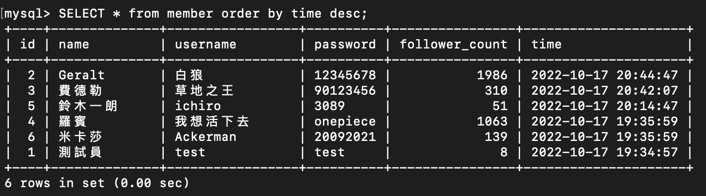
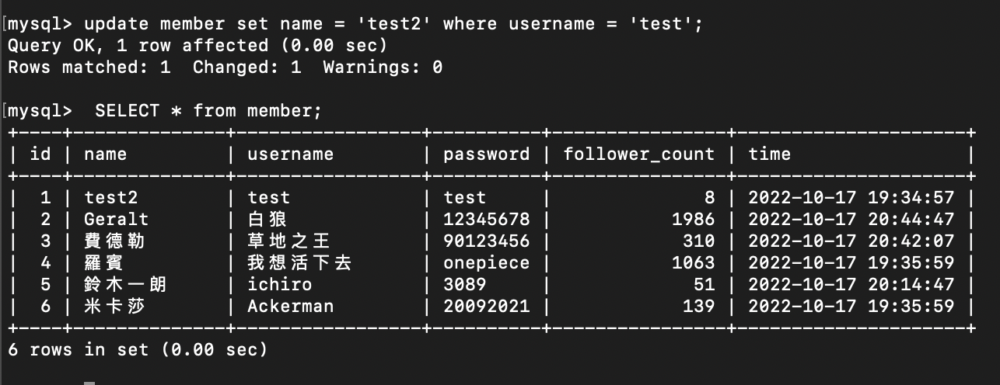
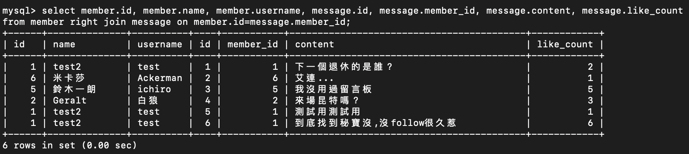

&emsp;&emsp;&emsp;&emsp;&emsp;&emsp;&emsp;Week5-Assignment
===================
&emsp;&emsp;&emsp;&emsp;&emsp;&emsp;&emsp;新手村，第五週，這東西，若拿去隔壁隔壁村的話，可以賣個好價錢！ 
&emsp; 

資料庫：website;  
資料表：member;  

資料表欄位設定資訊  `mysql> desc member;`

----- 
## 要求三:SQL CRUD  (Create、Read、Update、Delete)
### &emsp;1.使用 INSERT 指令新增一筆資料到 member 資料表中，這筆資料的 username 和 password 欄位必須是 test。  
>`mysql> insert into member(id, name, username, password, follower_count) values(1, '測試員', 'test', 'test', 8); `

#### &emsp;-接著繼續新增至少 4 筆隨意的資料。
>`mysql> insert into member(name, username, password, follower_count) values\  `

>    `-> ('Geralt', '白狼', '12345678', 1986),\`  

>    `-> ('費德勒', '草地之王', '90123456', 310),\`  

>    `-> ('羅賓', '我想活下去', 'onepiece', 1063),\`  

>    `-> ('米卡莎', 'Ackerman', '20092021', 139);`  
    

#### &emsp;-這邊因為同時增添了四筆資料，個人覺得後面時間排序感受不到差異，所以以下重新調整(另外再加一筆)，讓時間有明顯不同。  
&nbsp;  
### &emsp;2.使用 SELECT 指令取得所有在 member 資料表中的會員資料。
>`mysql>  SELECT * from member;`

&nbsp; 
### &emsp;3. 使用 SELECT 指令取得所有在 member 資料表中的會員資料，並按照 time 欄位，由近到遠排序。
>`mysql> SELECT * from member order by time desc;`

&nbsp; 
### &emsp;4. 使用 SELECT 指令取得 member 資料表中第 2 ~ 4 共三筆資料，並按照 time 欄位，由近到遠排序。( 並非編號 2、3、4 的資料，而是排序後的第 2 ~ 4 筆資料 )
>`mysql> SELECT * from member order by time desc limit 3 offset 1;`

&nbsp; 
### &emsp;5. 使用 SELECT 指令取得欄位 username 是 test 的會員資料。
>`mysql> SELECT * from member where username='test';`

&nbsp; 
### &emsp;6. 使用 SELECT 指令取得欄位 username 是 test、且欄位 password 也是 test 的資料。
>`mysql> SELECT * from member where username='test' and password='test';`

&nbsp; 
### &emsp;7. 使用 UPDATE 指令更新欄位 username 是 test 的會員資料，將資料中的 name 欄位改成 test2。
>`mysql> update member set name = 'test2' where username = 'test';`
  
&nbsp; 
----- 
## 要求四:SQL Aggregate Functions
### &emsp;1. 取得 member 資料表中，總共有幾筆資料 ( 幾位會員 )。
>`mysql> select count(*) as 幾位會員 from member;`

&nbsp; 
### &emsp;2. 取得 member 資料表中，所有會員 follower_count 欄位的總和。
>`mysql> select sum(follower_count) as follower_count總和 from member;`

&nbsp; 
### &emsp;3. 取得 member 資料表中，所有會員 follower_count 欄位的平均數。
>`mysql> select avg(follower_count) as follower_count平均數 from member;`

&nbsp; 
----- 
## 要求五:SQL JOIN (Optional)    

資料庫：website;  
資料表：message;

資料表欄位設定資訊  `mysql> desc message;`

### &emsp;1. 使用 SELECT 搭配 JOIN 語法，取得所有留言，結果須包含留言者會員的姓名。
>`mysql> select member.id, member.name, member.username, message.id, message.member_id, message.content, message.like_count from member right join message on member.id=message.member_id;`

&nbsp; 
### &emsp;2. 使用 SELECT 搭配 JOIN 語法，取得 member 資料表中欄位 username 是 test 的所有留言，資料中須包含留言者會員的姓名。
>`mysql> select member.name, member.username, message.id, message.member_id, message.content, message.like_count from member right join message on member.id=message.member_id where username='test';`

&nbsp; 
### &emsp;3. 使用 SELECT、SQL Aggregate Functions 搭配 JOIN 語法，取得 member 資料表中欄位 username 是 test 的所有留言平均按讚數。
>`mysql> select avg(like_count) as like_coun平均數 from member right join message on member.id=message.member_id where username='test';`
